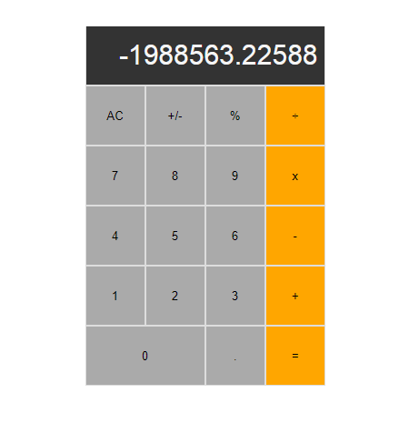

# Math Magicians
> Enjoy solving simple math questions while getting inspired by the greatest mathematicians!



## Built With

- Major languages
    - JavaScript
    - HTML & CSS
- Frameworks
    - ReactJS
- Technologies used
    - Git & Github
    - NodeJS
    - VSCode

## Getting Started

To get a local copy up and running follow these simple example steps.

### Prerequisites

- Install Git Bash
- Install NodeJS
- Have a code editor installed

### Setup

- Clone this repository using ```git clone https://github.com/JuliCarracedo/math-magicians-2.git```
- Open the downloaded folder with your code editor.

### Install

- Use ```yarn install``` in the code editor's command line

### Usage

- Use ```yarn start``` to launch the app 


## Author

👤 **Author1**

- GitHub: [@JuliCarracedo](https://github.com/JuliCarracedo)
- Twitter: [@CarracedoTrigo](https://twitter.com/CarracedoTrigo)
- LinkedIn: [Julian Carracedo](https://linkedin.com/in/julian-carracedo)

## 🤝 Contributing

Contributions, issues, and feature requests are welcome!

## Show your support

Give a ⭐️ if you like this project!

## Acknowledgments

- Hat tip to anyone whose code was used
- Inspiration
- etc

## 📝 License

This project is MIT licensed.